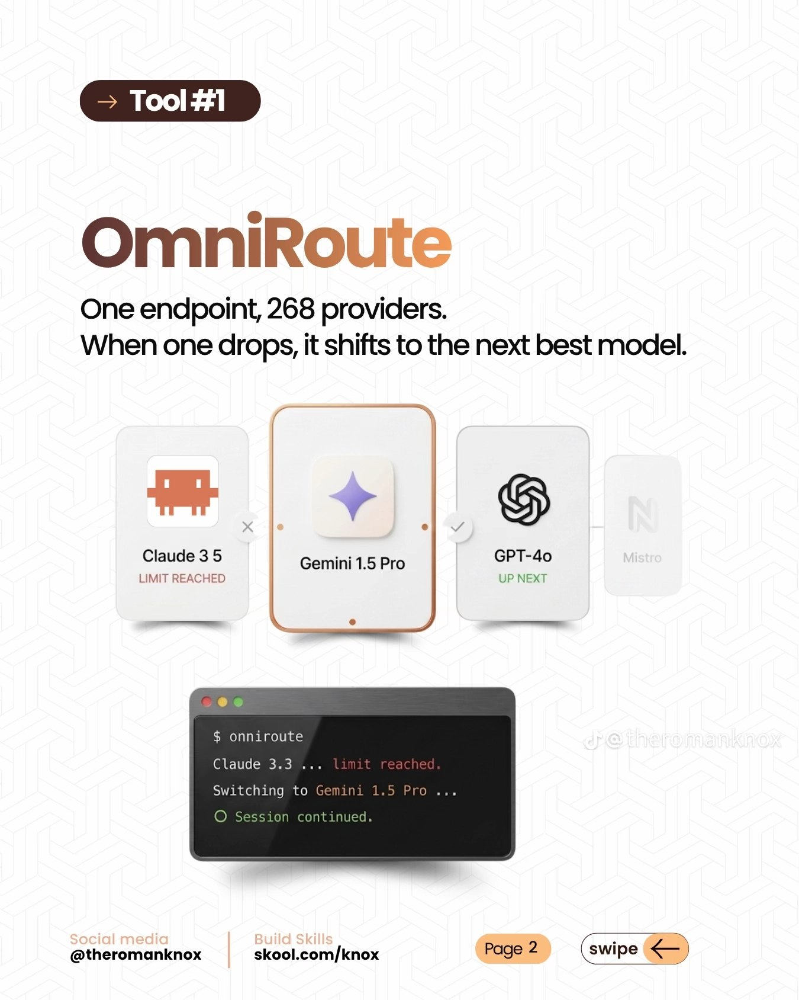
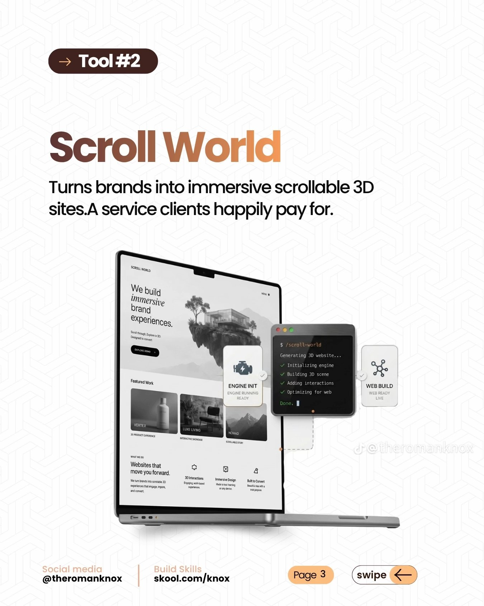
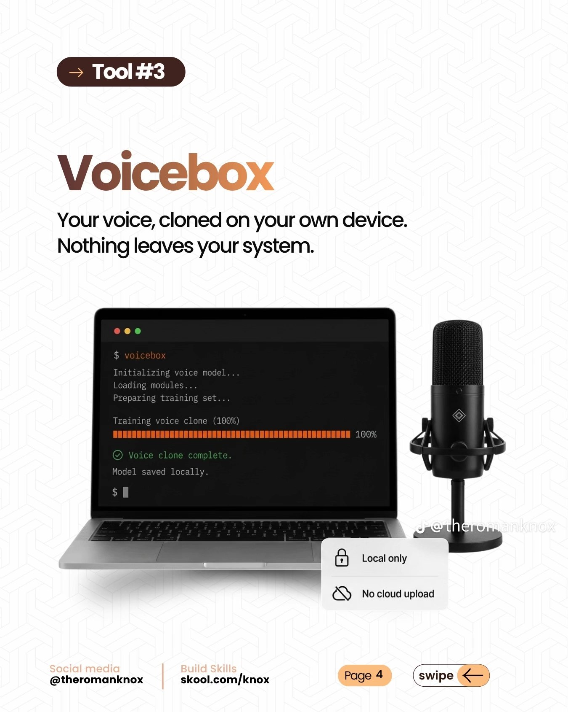
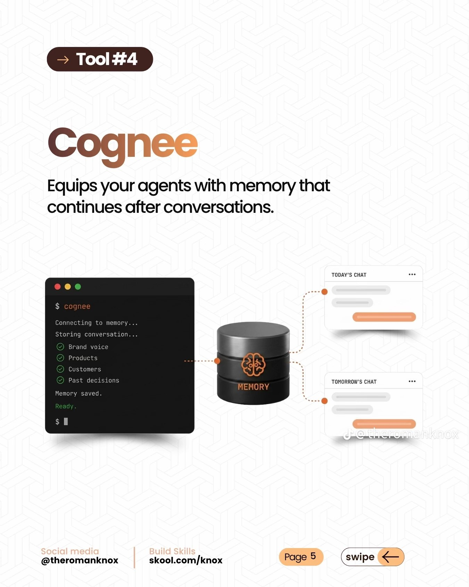
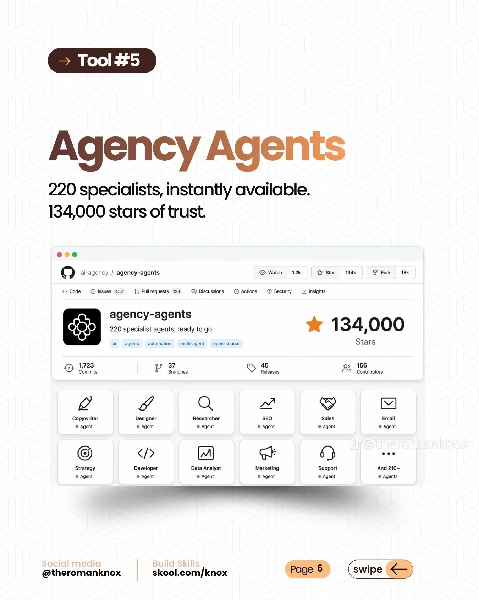

# 5 free tools that work with Claude

Open-source tools worth adding next to the skills in this repo. Each one is free and lives on GitHub.
These are third-party projects — not made by M-AVETECH IT SERVICES — so check each repo's own README and licence before using.


| # | Tool | What it does | Repo |
|---|---|---|---|
| 1 | **OmniRoute** | One AI endpoint in front of many providers. When one model hits its limit, it switches to the next best one so your session keeps going. | [diegosouzapw/OmniRoute](https://github.com/diegosouzapw/OmniRoute) |
| 2 | **Scroll World** | Claude Code skill that turns a brand into an immersive scroll-through 3D landing page — a service clients pay for. | [oso95/scroll-world](https://github.com/oso95/scroll-world) |
| 3 | **Voicebox** | Local voice cloning and voice studio. Runs on your own machine; nothing is uploaded to the cloud. | [jamiepine/voicebox](https://github.com/jamiepine/voicebox) |
| 4 | **Cognee** | Long-term memory for AI agents — keeps brand voice, products, customers and past decisions across chats. | [topoteretes/cognee](https://github.com/topoteretes/cognee) |
| 5 | **Agency Agents** | A big library of ready-made specialist agents (copywriter, designer, SEO, sales, developer, support…) for Claude Code. | [msitarzewski/agency-agents](https://github.com/msitarzewski/agency-agents) |

---

## 1. OmniRoute


Point your apps or coding tools at one OpenAI-compatible endpoint and let OmniRoute route to whichever provider is available, with automatic fallback.
See the repo for Docker / npm setup.

## 2. Scroll World


Install in Claude Code:
```
/plugin marketplace add oso95/scroll-world
/plugin install scroll-world@scroll-world
```
Then ask for "a scroll-through world landing page" or run `/scroll-world`.
Pairs well with **web-experience-pro** and **component-lab** in this repo for the rest of the site.

## 3. Voicebox


Desktop app for cloning a voice and generating speech locally — handy for promo videos and voice-overs for your data-bundle sites. Downloads are on the repo's Releases page.

## 4. Cognee


```
pip install cognee
```
Feed it your docs and decisions; your agents can then query that memory in later conversations. It also ships an MCP server so Claude can use it directly.

## 5. Agency Agents


```
git clone https://github.com/msitarzewski/agency-agents.git
cd agency-agents
./scripts/install.sh --tool claude-code   # copies agents into ~/.claude/agents/
```
Or copy just one group, e.g. `cp engineering/*.md ~/.claude/agents/`.

---
Slides from @theromanknox. Star counts and feature claims on the slides are theirs — check each repo for current numbers.
